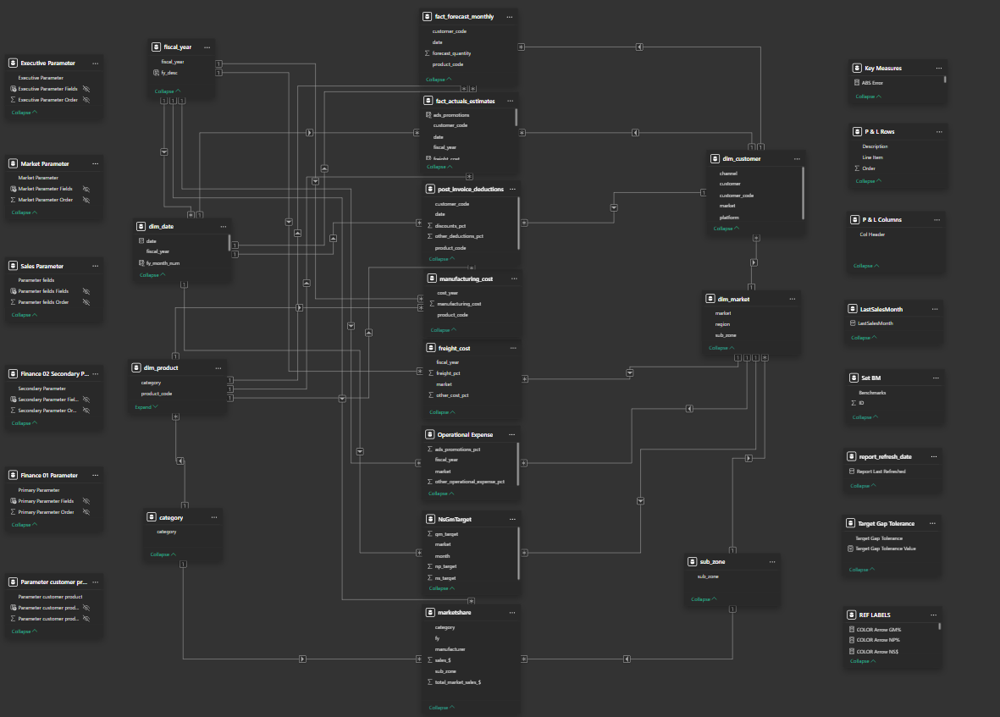

# AtliQ Hardware Business Insights 360

## Project Overview
AtliQ Hardware, a multinational company specializing in computer hardware and accessories, experienced financial setbacks after expanding into the American market. The leadership identified a lack of data-driven decisions as a core issue. This project aims to develop a centralized Power BI solution to visualize key metrics across departments—Finance, Sales, Marketing, Supply Chain, and Executive functions—for actionable insights and improved decision-making.

**[Live Dashboard Link](https://app.powerbi.com/view?r=eyJrIjoiYWFmZDQxZWUtOGMyMi00YWIzLWI4ZjEtNjhhMmIzYWI0YTRlIiwidCI6ImM2ZTU0OWIzLTVmNDUtNDAzMi1hYWU5LWQ0MjQ0ZGM1YjJjNCJ9)**  
**Date**: February 2025 
**Author**: Vasu

---

## Table of Contents
1. [Objectives](#objectives)  
2. [Datasets & Sources](#datasets--sources)  
3. [Data Modeling](#data-modeling)  
4. [Dashboard Overview](#dashboard-overview)  
5. [Key Business Insights](#key-business-insights)  
6. [Challenges & Learnings](#challenges--learnings)  
7. [Future Scope](#future-scope)  
8. [Skills Applied](#skills-applied)  

---

## Objectives
- Build a centralized analytics solution using Power BI.
- Provide actionable insights across key business verticals.
- Empower stakeholders with interactive and insightful reports.
- Track and analyze KPIs like profitability, forecast accuracy, and market share.

---

## Datasets & Sources

**Sources Used:**
- **MySQL Database**: Main transactional and dimensional tables.
- **Excel/CSV Files**: Supplementary data like targets and market share.

**Key Tables:**
- `dim_customer`, `dim_product`, `dim_market`
- `fact_sales_monthly`, `fact_forecast_monthly`
- `freight_cost`, `gross_price`, `market_share`

---

## Data Modeling
- **Schema**: Snowflake Schema  
- **Key Actions**:
  - Data extraction via MySQL
  - Cleaning and shaping in Power Query
  - Relationship management in Model View
  - DAX for KPIs, dynamic visuals, and advanced logic

---

##  Dashboard Overview

### Home Page
- Visual navigation using bookmarks  
- Last refresh date and data currency indicators  

### Finance View
- Net Sales, Gross Margin %, Net Profit % KPIs  
- Profit & Loss summary  
- Top/Bottom product & customer profitability  

### Sales View
- Customer & product performance metrics  
- Performance matrix and donut breakdowns  

### Marketing View
- Segment-wise profitability  
- Dual-filter scatter plots  
- Waterfall and donut chart breakdowns  

### Supply Chain View
- Forecast accuracy vs. error analysis  
- Monthly error trends  
- Supply chain KPIs per product  

### Executive Summary
- High-level KPIs  
- Channel/division revenue splits  
- Yearly trends and subzone performance  

---

## Key Business Insights
- **Finance**: Identified most and least profitable products, and net sales trends.
- **Sales**: Pinpointed customer segments contributing most to revenue.
- **Marketing**: Assessed performance by region/market segment.
- **Supply Chain**: Measured forecast errors to optimize inventory planning.
- **Executive**: Provided a snapshot for stakeholders to monitor all major metrics.

---

## Challenges & Learnings

### Challenges
- Faced difficulty writing advanced **DAX** measures.
- Managing **many-to-many relationships**.
- Ensuring **Data cleaning** by dealing with missing, duplicate, and inconsistent data while transforming large datasets across multiple tables
- Initially struggled to **configure bookmarks** correctly for toggling visuals using buttons.

### Learnings
- Understanding and Using Parameters: Learned how to create and use parameters in Power BI to enable dynamic filtering, data source switching, and enhanced user interactivity within reports.
- Mastering Tooltips for Enhanced Insights: Gained hands-on experience in creating report page tooltips to provide additional context and trend analysis without cluttering the main visuals.
- Deepened DAX Proficiency: Learned to write efficient and complex DAX measures and calculated columns to perform dynamic aggregations, time intelligence, and conditional logic for deriving meaningful business insights. Also learned how to handle many-to-many relationships using reference tables and DAX functions like ALLNOBLANKROW to ensure accurate calculations.
- Advanced Visualizations with Bookmarks: Learned how to use bookmarks in Power BI to toggle between multiple visuals on a single page using buttons, enhancing interactivity and user experience without overcrowding the report.
- Performance Optimization with DAX Studio: Utilized DAX Studio to analyze and optimize Power BI file size and DAX queries, resulting in improved report performance and reduced loading times.
- Understanding of Business KPIs Across Verticals: Gained comprehensive knowledge of key performance indicators (KPIs) in finance, sales, marketing, supply chain, and executive domains to drive data-informed decision-making.

---

## Future Scope
- Integrate predictive analytics using AI visuals.
- Automate scheduled reporting and alerts.
- Add new modules (HR, Inventory, CRM).

---

## Skills Applied

### Technical
- Data Modeling (Snowflake Schema)  
- Power BI Desktop, Power Query, DAX, Tooltips  
- SQL (MySQL) for Data Extraction  
- DAX Studio for optimization  

### Soft Skills  
- Storytelling with Data  
- Stakeholder Management  
- Dashboard Design with Empathy
